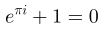
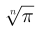

# JMathTeX

Java library for displaying mathematical formulas using TeX notation.

This is a fork of the [JMathTex](http://jmathtex.sourceforge.net) project
to create a plain TeX implementation that can render TeX formulas in
real-time. Besides performance, the fork fixes rendering issues with the
original.

This is _not_ [LaTeX](https://github.com/opencollab/jlatexmath) engine.

# Output

Sample output:

