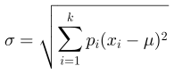
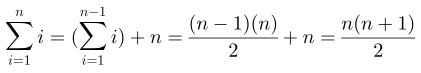

# JMathTeX

Java library for displaying mathematical formulas using TeX notation.

This is a fork of [JMathTex](http://jmathtex.sourceforge.net). The intention
of the fork is to render simple math-oriented formulas in real-time.
Besides performance, the fork fixes rendering issues with the original.
This is _not_ a [LaTeX](https://github.com/opencollab/jlatexmath) engine,
nor a full implementation of TeX. Rather, it is a subset of TeX that can
be used to generate simple mathematical expressions.

The library can parse and generate 1,000 simple formulas into SVG format
in about 500 milliseconds on modern hardware.

# Building

Build the library as follows:

    gradle clean build

This will run the unit tests, which write SVG files into `/tmp` on Linux.

# Getting Started

Use the library as follows:

* Initialize the TeX fonts and graphics engine.
* Parse the TeX formula into a root-level box.
* Resize the graphics engine to fit the box contents.
* Display (or export) the vector graphics as needed.

Let's see an example.

## Initialization

Generating a formula requires a font, a font size, and a graphics engine.
The graphics engine must be scaled to the font size for its internal
matrix transformations. Accomplish these steps as follows:

``` java
final var size = 20f;
final var texFont = new DefaultTeXFont( size );
final var env = new TeXEnvironment( texFont );
final var g = new SvgGraphics2D();
g.scale( size, size );
```

The font, environment, and graphics objects are reusable, but not
thread-safe. The `SvgGraphics2D` is a high-performance, bare-bones drop-in
replacement for Java's `Graphics2D` class. It is faster than the equivalent
functionality from either Batik or JFreeSVG because it optimizes for
transcoding glyph path coordinates into SVG paths.

Much of the code that configures the system takes place in `static` blocks
that run only once, prior to instantiating classes.

## Parse TeX

Given an equation, parse it into a layout suitable for rendering as
follows:

``` java
final var equation = "\\sigma=\\sqrt{\\sum_{i=1}^{k} p_i(x_i-\\mu)^2}";
final var formula = new TeXFormula( equation );
final var box = formula.createBox( env );
final var layout = new TeXLayout( box, size );
```

The `layout` object contains the final bounding rectangle that fully
encapsulates the equation.

## Resize Graphics

Having a reusable `SvgGraphics2D` object requires resetting its state
each time a new formula is to be drawn. This is accomplished by calling
`initialize` using the dimensions from the `TeXLayout` object:

``` java
g.initialize( layout.getWidth(), layout.getHeight() );
box.draw( g, layout.getX(), layout.getY() );
```

Calls to `box.draw` can take any valid `Graphics2D` class or subclass.
The `SvgGraphics2D` class implements the minimum drawing primitives used
to draw the glyph boxes.

## Generate Scalable Vector Graphics

At this point, the internal buffer for `SvgGraphics2D` contains a nearly
complete document. Finalize and extract the document by calling `toString()`:

``` java
System.out.println( g.toString() );
```

# Output

Here are scalable vector graphics produced by the library:








