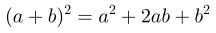
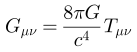

# JMathTeX

Java library for displaying mathematical formulas using TeX notation.

This is a fork of the [JMathTex](http://jmathtex.sourceforge.net) project
to create a plain TeX implementation that can render TeX formulas in
real-time. Besides performance, the fork fixes rendering issues with the
original. This is _not_ a [LaTeX](https://github.com/opencollab/jlatexmath)
engine.

The library can parse and generate 1,000 TeX simple formulas into SVG
format in about 500 milliseconds on modern hardware, which should suffice
for real-time rendering requirements.

# Building

Build the library as follows:

    gradle clean build

This will run the unit tests, which write SVG files into `/tmp` on Linux.

# Getting Started

The general steps to using the library follows:

* Initialize the TeX fonts and graphics engine.
* Parse the TeX formula into a root-level box.
* Resize the graphics engine to fit the box contents.
* Display (or export) the vector graphics as needed.

Let's take a look at these in code.

## Initialization

Generating a formula requires a font, a font size, and a graphics engine.
The graphics engine must be scaled to the font size for its internal
matrix transformations. These steps can be accomplished as follows:

``` java
final var size = 20f;
final var texFont = new DefaultTeXFont( size );
final var g = new SvgGraphics2D();
g.scale( size, size );
```

The `SvgGraphics2D` is not thread-safe, but can be reused. It is
a high-performance, bare-bones drop-in replacement for Java's
`Graphics2D` class. It is faster than the equivalent functionality
from either Batik or JFreeSVG.

## Parse TeX

Given a string of TeX, parse it into a layout suitable for rendering as
follows:

``` java
final var equation = "\\sigma=\\sqrt{\\sum_{i=1}^{k} p_i(x_i-\\mu)^2}";
final var formula = new TeXFormula( equations );
final var env = new TeXEnvironment( TeXConstants.STYLE_DISPLAY, texFont );
final var box = formula.createBox( env );
final var layout = new TeXLayout( box, size );
```

The `layout` object contains the final bounding rectangle for the TeX
equation.

## Resize Graphics

Having a reusable `SvgGraphics2D` object requires resetting its state
each time a new formula is to be drawn. This is accomplished by calling
`setDimensions` using the dimensions from the `TeXLayout` object:

``` java
g.setDimensions( layout.getWidth(), layout.getHeight() );
box.draw( g, layout.getX(), layout.getY() );
```

Calls to `box.draw` can take any valid `Graphics2D` class or subclass.
The `SvgGraphics2D` class implements the minimum drawing primitives used
to draw the TeX boxes.

## Generate Scalable Vector Graphics

At this point, the internal buffer for `SvgGraphics2D` contains a nearly
complete document. Extract the document by calling `toString()`:

``` java
System.out.println( g.toString() );
```

# Output

Sample output showing scalable vector graphics produced by the library:







